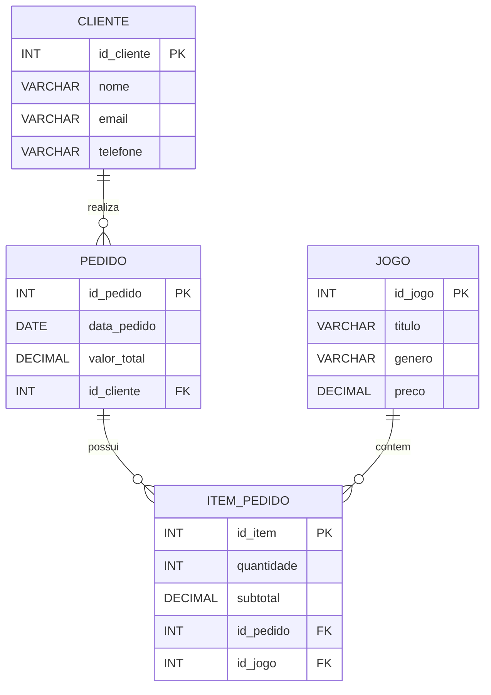
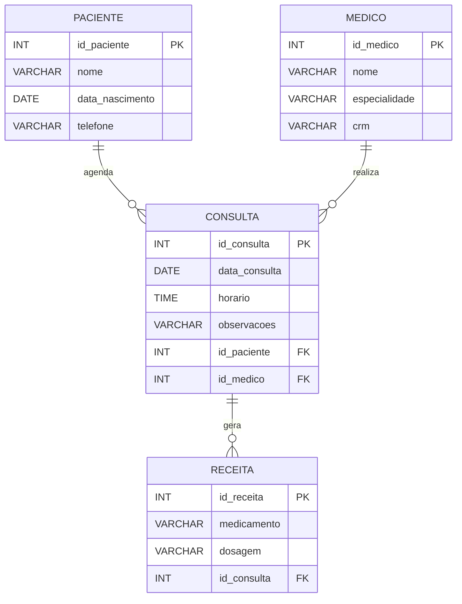
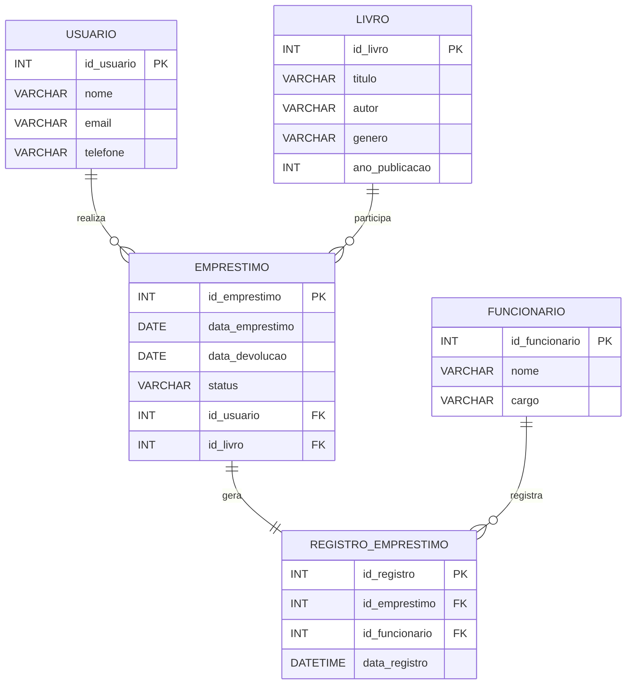

# 🛠️ Atividade Complementar – Do DER ao SQL

## 🎯 Objetivo

Transformar diagramas de Entidade-Relacionamento (DER) em código SQL, criando bancos de dados completos no MySQL a partir de modelos conceituais.

---

# 📚 Diagramas

## 🎮 Loja de Games

---

## 🏥 Clínica Médica

---

## 📖 Sistema de Biblioteca

---

# 📝 Instruções

1. Para cada diagrama:

   * Crie um **banco de dados** separado no `MySQL Workbench`.
   * Crie todas as tabelas, colunas, chaves primárias e estrangeiras conforme o modelo.

2. Após criar as tabelas:

   * Insira pelo menos **5 registros em cada tabela** utilizando `INSERT INTO`.
   * Realize:

     * **2 comandos `UPDATE`**
     * **2 comandos `DELETE`**

3. Após finalizar:

   * Salve os códigos SQL em arquivos separados (`der1.sql`, `der2.sql`, `der3.sql`).
   * Compacte todos os arquivos em `.zip`.
   * Envie na [discussão](https://github.com/dhDSouza/UC3_TDS26-1T/discussions/4).

---

# ⚠️ Regras

* Utilize nomes de tabelas e colunas iguais aos do DER.
* Utilize corretamente os tipos de dados (`VARCHAR`, `INT`, `DATE`, `DECIMAL`...).
* Utilize corretamente as `PRIMARY KEY` e `FOREIGN KEY`.
* Utilize `AUTO_INCREMENT` quando necessário.
* Os comandos devem executar sem erros no MySQL.

